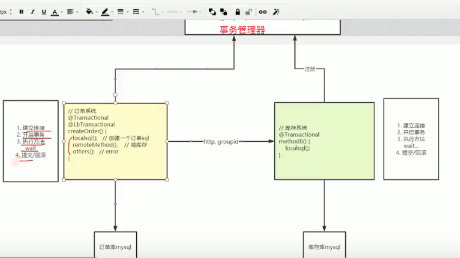

[apache seata 开源官网](https://seata.io/)

# 技术栈
- 使用netty进行分布式服务之间的事务通信技术；

# 实现思路

- 自定义注解 @LbTransactional，用于标记每个需要使用分布式事务的方法；
- 自定义切面 LbTransactionAspect 控制每个标记 @LbTransactional 注解方法： 
① 创建一个全局事务；② 执行事务；③ 确认执行结果，异常则回滚否则提交；
- 自定义切面 LbDataSourceAspect 控制获取数据库连接方法 javax.sql.DataSource.getConnection(); 
- 在执行 @Transactional 事务时，将建立数据库连接 Connection 传递到自定义数据库连接 LbConnection 对象中；
- 通过 LbConnection 实现 Connection 接口，在commit方法中使用异步线程控制事务的提交或回滚：使用 ReentrantLock 实现事务提交阻塞，直到收到 LbTransactionAspect 中的结果进行提交或回滚，并最终关闭连接（使用异步线程，是为了防止阻塞 LbTransactionAspect 中的事务通知）；
- 使用 LbTransaction

# 知识点
- AT 阿里首推模式，事务模式，为自动提交事务
- TCC 事务模式，
- SAGA
- XA
- GTS，global transaction service，全局事务服务，商用版本

常见分布式事务解决方案：① seata；② mq；③ saga；④ XA;